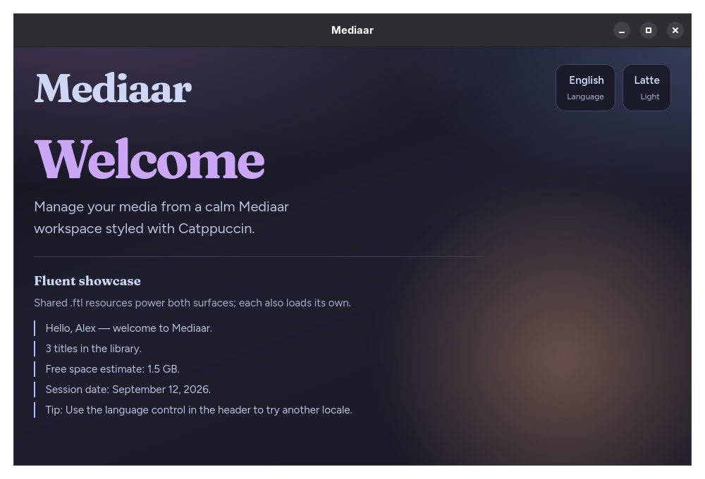
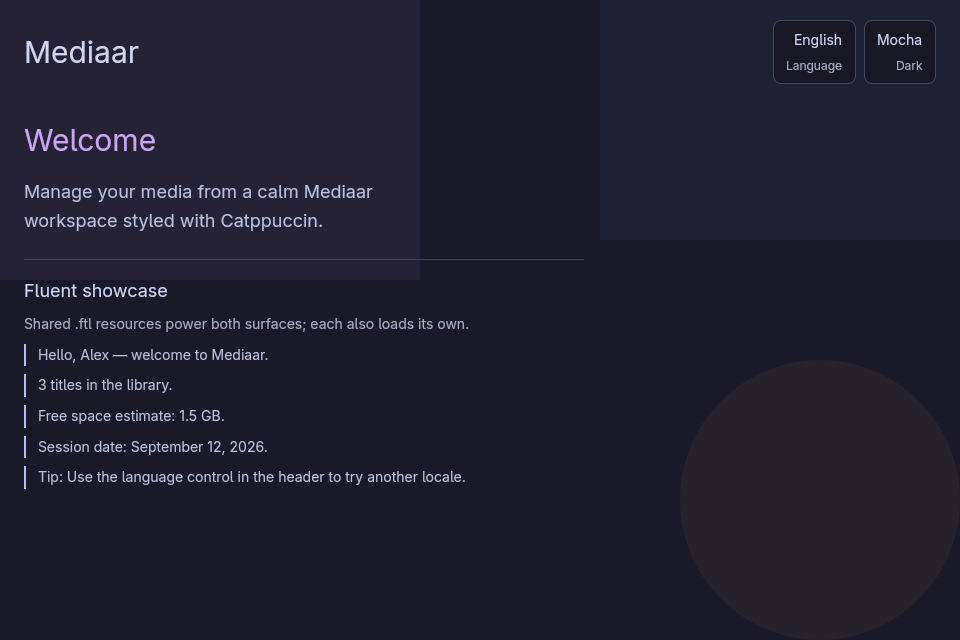

# Desktop stack comparison (Tauri → GPUI)

Measured on this machine with `benches/measure-desktop.sh` and `benches/capture-desktop.sh`.

## Screenshots

Floating ~960×640 welcome window on niri (same compositor session).

| Tauri + Solid | GPUI |
| --- | --- |
|  |  |

## Method

| Metric | How |
| --- | --- |
| Package rebuild | `cargo clean -p mediaar` then `cargo build -p mediaar --release` (crate graph already warm) |
| Binary size | `stat` on `target/release/mediaar` |
| `--help` startup | 10 sequential runs, average wall time |
| Desktop startup | spawn → `MEDIAAR_BENCH_READY_FILE` written (5 runs) |
| Memory | After window settle: main `VmRSS` / `Pss`, plus process-tree RSS (WebKit helpers for Tauri) |
| Dep crates | unique crates from `cargo tree -p mediaar` |
| Screenshots | `niri msg action screenshot-window` via `capture-desktop.sh` |

**Caveats**

- Tauri “ready” is native `setup` (before Solid/webview paint). GPUI “ready” is when the window entity is created. Usable-UI time for Tauri is likely higher than reported.
- First desktop sample is a cold-ish outlier; steady-state averages below drop run 1.
- Package rebuild does **not** include compiling the dependency graph from scratch. GPUI’s first full fetch/compile was multi-minute.
- Memory is a single settled sample (not averaged). Tree RSS is the fairer Tauri number because WebKitGTK spawns helper processes.

## Results

| Metric | Tauri + Solid | GPUI | Δ |
| --- | --- | --- | --- |
| Package rebuild | 72.2 s | 81.3 s | **+12.6%** |
| Binary size | 7.1 MB (7,411,864 B) | 13 MB (13,251,360 B) | **+78.8%** |
| Unique dep crates | 327 | 521 | **+59.3%** |
| UI dist payload | 112 KB | n/a (0) | removed web assets |
| `--help` avg | 39.1 ms | 2.5 ms | **−93.6%** |
| Desktop ready avg (all 5) | 218.2 ms | 177.8 ms | **−18.5%** |
| Desktop ready avg (runs 2–5) | 208.0 ms | 105.8 ms | **−49.1%** |
| Memory RSS (main) | 153.5 MB | 44.1 MB | **−71.3%** |
| Memory PSS (main) | 89.6 MB | 32.7 MB | **−63.5%** |
| Memory RSS (process tree) | 463.4 MB | 44.1 MB | **−90.5%** |

Raw JSON: [`results-tauri.json`](results-tauri.json), [`results-gpui.json`](results-gpui.json).

## Takeaways

1. **RAM** — GPUI uses roughly **¼** the main-process RSS and about **¹⁄₁₀** the process-tree RSS versus Tauri+WebKit.
2. **Startup (steady)** — GPUI reaches the ready probe about **2× faster** after the first run.
3. **CLI feel** — `--help` is dramatically snappier (likely less static/runtime weight at process start).
4. **Binary weight** — GPUI currently ships a **larger** release binary and a denser crate graph (Blade/Vulkan/Wayland stack).
5. **Build** — warm package rebuild is in the same ballpark; expect a heavier *cold* dependency compile the first time GPUI is introduced.
6. **Architecture** — no Node/pnpm/Vite/WebKit path for desktop anymore; Fluent + Catppuccin stay in-process Rust. Visual polish (fonts/gradients) still favors the Solid/CSS welcome.
